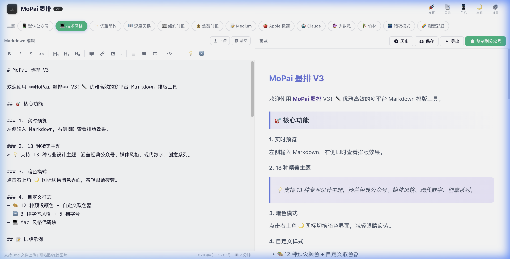
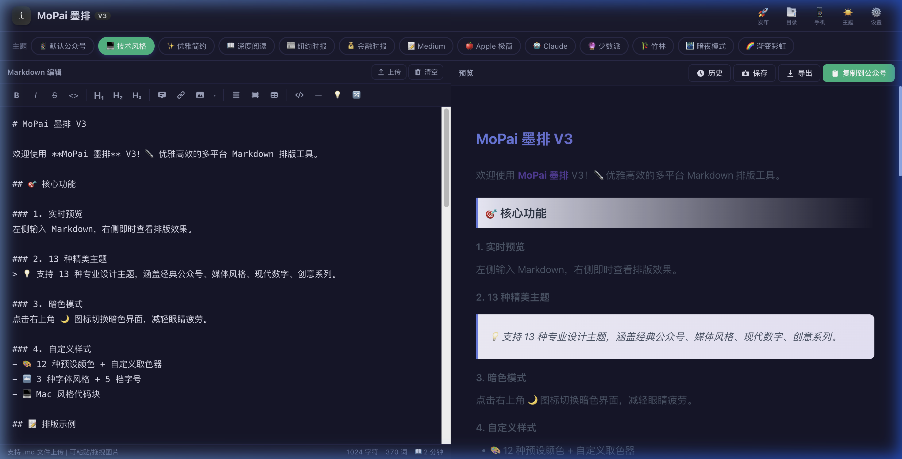
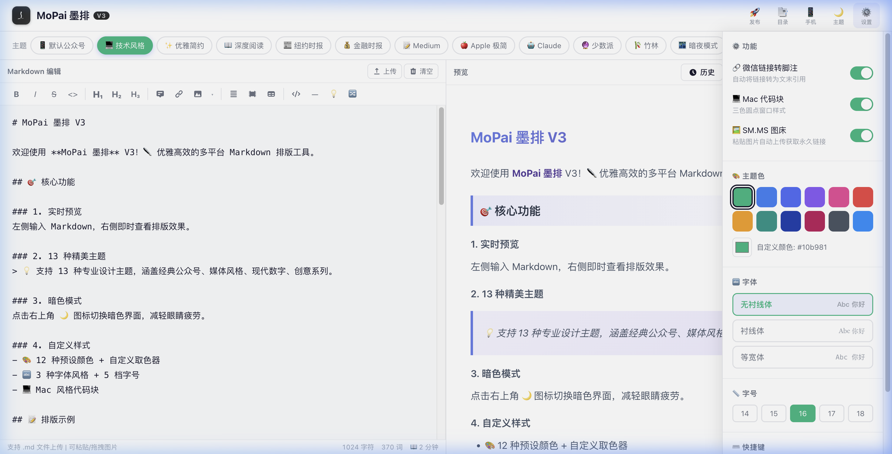

# MoPai 墨排 ✒️

> 优雅高效的多平台 Markdown 排版工具

MoPai 墨排是一款本地运行的 Markdown 排版编辑器，专为微信公众号、知乎、CSDN 等内容平台的创作者设计。提供 13+ 精美主题、暗色模式、一键复制到公众号、多平台一键分发等功能。


## 📸 预览

| 主界面 | 暗色模式 |
|:---:|:---:|
|  |  |

| 发布助手 | 设置面板 |
|:---:|:---:|
|  |  |

## ✨ 核心功能

### 📝 编辑器
- **实时预览** — 左侧 Markdown 编辑，右侧即时渲染
- **撤回/重做** — ⌘Z 撤回、⌘⇧Z 重做，最多 50 步历史
- **渲染防抖** — 输入 300ms 后才渲染预览，长文编辑不卡顿
- **格式工具栏** — 加粗、斜体、标题、链接、图片、代码块等一键插入
- **Tab 缩进** — 编辑器支持 Tab/Shift+Tab 缩进
- **查找替换** — ⌘F 打开查找，支持全文替换
- **专注模式** — ⌘\ 隐藏侧边栏，全屏写作
- **行号显示** — 可在设置中开关
- **快捷键** — ⌘B/⌘I/⌘K/⌘S/⌘Z/⌘⇧Z/⌘F/⌘\ 等

### 🎨 主题与样式
- **13 种精美主题** — 默认公众号、技术风格、优雅简约、深度阅读、纽约时报、金融时报、Medium、Apple 极简、Claude、少数派、竹林、暗夜模式、渐变彩虹
- **暗色模式** — 一键切换深色/浅色界面
- **自定义颜色** — 12 种预设色 + 取色器
- **字体设置** — 3 种字体风格 + 5 档字号
- **自定义 CSS** — 高级用户可注入自定义样式
- **Mac 风格代码块** — 带红黄绿圆点的代码块

### 🚀 发布与分发
- **14 平台一键发布** — 微信公众号、知乎、微博、CSDN、简书、掘金、今日头条、B站专栏、百家号、SF思否、大鱼号、企鹅号、小红书、豆瓣
- **🆕 多平台一键分发** — 集成 [WechatSync](https://github.com/wechatsync/Wechatsync) SDK，安装 Chrome 扩展后可一键同步到 29+ 平台
- **智能格式适配** — 自动为每个平台复制最优格式（富文本/Markdown/摘要）
- **一键复制到公众号** — 复制富文本直接粘贴到微信编辑器（⌘⇧C）

### 📱 预览与导出
- **手机预览模式** — 模拟手机屏幕预览排版效果
- **📱 手机端自适应** — 移动端编辑/预览 Tab 切换，完整功能可用
- **导出 HTML** — 完整 HTML 文件
- **导出 PDF** — 打印为 PDF
- **🆕 导出长图** — 完整文档截图导出为 PNG
- **🆕 导出 Word** — 导出 .docx 文件
- **🆕 智能文件名** — 导出文件自动使用文章标题命名
- **同步滚动** — 编辑器与预览区流畅同步滚动

### 🖼️ 图片处理
- **图片粘贴** — ⌘V 粘贴图片，自动嵌入
- **Base64 智能隐藏** — 编辑器内以短占位符显示，预览/导出时还原完整数据
- **SM.MS 图床** — 粘贴图片自动上传获取永久链接（可关闭）
- **拖拽上传** — 直接拖拽图片到编辑器

### 🔧 其他功能
- **浮动大纲目录** — TOC 面板快速跳转
- **微信链接转脚注** — 自动将超链接转为脚注格式
- **Mermaid 图表** — 支持流程图、时序图等
- **模板库** — 内置多种 Markdown 模板
- **草稿自动保存** — 内容自动保存到本地
- **文件上传** — 支持上传 .md 文件
- **字数统计** — 实时显示字数、字符数、阅读时间
- **写作目标** — 设置字数目标，进度条实时追踪
- **PWA 支持** — 可安装为桌面应用离线使用

## 🔄 多平台分发（WechatSync 集成）

MoPai 内置了 [WechatSync](https://github.com/wechatsync/Wechatsync) SDK，支持一键将排版好的文章同步到 29+ 平台。

### 使用步骤

1. 安装 [文章同步助手 Chrome 扩展](https://chrome.google.com/webstore/detail/hchobocdmclopcbnibdnoafilagadion)
2. 在各目标平台的网页端登录账号
3. 在 MoPai 编辑器中写好/排版好文章
4. 点击工具栏「导出 ▾」→「🚀 分发到多平台」
5. WechatSync 弹出同步对话框，勾选目标平台，一键发布

> 自动提取文章标题和首图作为封面，同步为草稿模式，发布前可在各平台二次编辑确认。

## 🚀 快速开始

```bash
# 克隆项目
git clone https://github.com/ye4wzp/mopai-markdown.git
cd mopai-markdown

# 启动本地服务器（三选一）
python3 -m http.server 8080
# 或
npx serve -p 8080
# 或
php -S localhost:8080

# 打开浏览器访问
open http://localhost:8080
```

无需安装任何依赖，纯前端项目，开箱即用。

## ⌨️ 快捷键

| 快捷键 | 功能 |
|--------|------|
| `⌘B` | 加粗 |
| `⌘I` | 斜体 |
| `⌘K` | 插入链接 |
| `⌘S` | 保存到历史 |
| `⌘Z` | 撤回 |
| `⌘⇧Z` | 重做 |
| `⌘⇧C` | 复制到公众号 |
| `⌘F` | 查找替换 |
| `⌘\` | 专注模式 |
| `Esc` | 退出专注/查找 |

## 📦 技术栈

- **Vue 3** — CDN 引入，无需构建工具
- **markdown-it** — Markdown 解析引擎
- **Highlight.js** — 代码语法高亮
- **Mermaid.js** — 图表渲染
- **html2canvas** — 长图导出
- **html-docx-js** — Word 导出
- **WechatSync SDK** — 多平台分发
- **原生 CSS** — 无框架依赖，自定义设计系统

## 📁 项目结构

```
mopai-markdown/
├── index.html          # 主页面
├── manifest.json       # PWA 配置
├── sw.js               # Service Worker
├── css/
│   └── styles.css      # 样式文件
├── js/
│   ├── app.js          # Vue 应用主逻辑
│   └── themes.js       # 13 种主题定义 + 示例内容
├── screenshots/        # 项目截图
└── README.md
```

## 🙏 致谢

本项目的开发受到以下优秀开源项目的启发：

| 项目 | 作者 | 贡献 |
|------|------|------|
| [花生编辑器 (huasheng_editor)](https://github.com/alchaincyf/huasheng_editor) | [@alchaincyf](https://github.com/alchaincyf) | 项目灵感来源，参考了其 Markdown 转公众号的核心思路 |
| [doocs/md](https://github.com/doocs/md) | [@doocs](https://github.com/doocs) | 参考了其主题设计和排版理念 |
| [Wechatsync](https://github.com/wechatsync/Wechatsync) | [@lljxx1](https://github.com/lljxx1) | 多平台分发 SDK 集成 |
| [markdown-it](https://github.com/markdown-it/markdown-it) | markdown-it 团队 | Markdown 解析引擎 |
| [Highlight.js](https://github.com/highlightjs/highlight.js) | Highlight.js 团队 | 代码语法高亮 |
| [Mermaid](https://github.com/mermaid-js/mermaid) | Mermaid 团队 | 图表渲染支持 |

## 📄 License

MIT License © 2025
